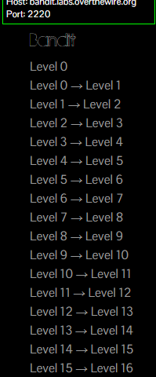

# Seguridad en Redes Y Sistemas de Software

## Notas De Los Retos Ya Resueltos

### Angel Janvier Gonzalez Delgado, gonzalezdelgadoangeljanvier@gmail.com 😏😏

https://overthewire.org/wargames/bandit/
https://overthewire.org/wargames/bandit/
https://overthewire.org/wargames/bandit/
https://overthewire.org/wargames/bandit/
https://overthewire.org/wargames/bandit/
https://overthewire.org/wargames/bandit/

https://play.picoctf.org/assignments
https://play.picoctf.org/assignments
https://play.picoctf.org/assignments
https://play.picoctf.org/assignments
https://play.picoctf.org/assignments
https://play.picoctf.org/assignments

